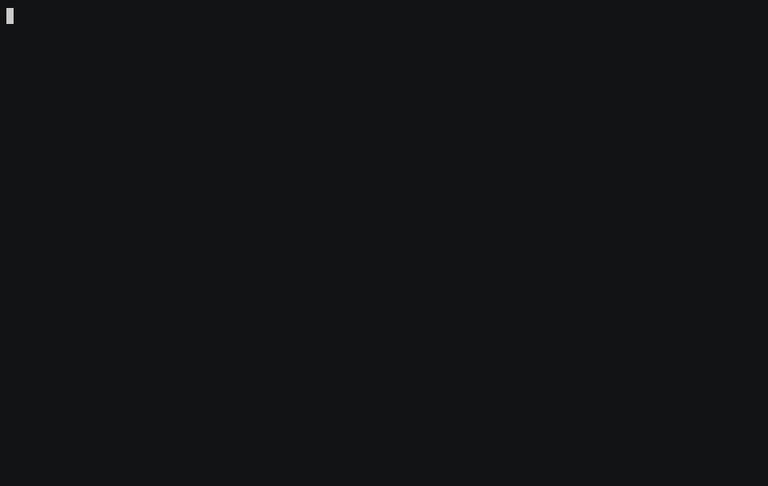

# CloudPilot

A read-only command that finds the money your AWS account is wasting and
prints the exact command that would fix each item. A scan changes nothing.
`apply` is the only command that can change anything, and only what you name
and approve; `watch --autopilot` is the one other thing that can, off unless
you turn it on, only for the rules you name, and only for fixes that can be
undone.

```sh
npx @meruapps/cloudpilot
```

Run it in AWS CloudShell, or anywhere with Node 18 or later and AWS
credentials. It reads every region enabled for the account and ends with an
itemised list: what is wasted, the evidence, what it costs per month, the fix
command, and what about that fix cannot be undone.



The capture is a replay of recorded scans of our own test labs, which is why
each command shows `REPLAY MODE`. It is made by [`demo/capture.py`](demo/capture.py)
from recordings in this repository, and a test fails if it stops matching what
the commands print.

## What it finds

In an AWS account:

Unattached EBS volumes, gp2 volumes that would be cheaper as gp3, idle
Elastic IPs, stopped instances still paying for storage, idle running
instances, running instances that are one size too big for their CPU use, idle
RDS database instances, idle NAT gateways, idle Application and Network load
balancers, snapshots of deleted volumes, unused AMIs, buckets with no lifecycle
rule, and incomplete multipart uploads. The rules, their confidence and their
limits are in [`packages/cli/README.md`](packages/cli/README.md).

In a Kubernetes cluster, with `npx @meruapps/cloudpilot kube`:

Workloads that request more CPU or memory than they use, volume
claims no pod mounts, and volumes left Released. It reads through your own
`kubectl` and the cluster's Prometheus, and prints the `kubectl` command for
each fix with the old values as the way back.

## How it works

1. **Read.** It asks AWS what exists, using only Describe, List and Get calls.
2. **Apply rules.** Each kind of waste is a fixed rule over what it read.
3. **Price.** Unit prices come from the AWS Price List.
4. **Report.** Findings go to the terminal, and optionally to JSON, Markdown,
   a self-contained HTML file, a Slack, Discord or other webhook, or
   CloudPilot's hosted service.

None of that uses AI, so the same account always gives the same answer and no
API key is needed. A model is optional: with a key, `--explain` writes the
summary in prose and `ask` answers questions about the findings. The model
never computes a figure, and its text is discarded if it mentions a number or
resource ID that is not in the scan.

## How it stays safe

- **It only reads.** Every AWS call is listed in the CLI README, and a test
  fails if the code calls anything else.
- **A scan never runs a fix.** It prints the commands for a person to review.
  `kube`, `ask`, `anomalies`, `init` and `mcp` change nothing in your account
  or cluster either, and neither does `watch` unless you turn on `--autopilot`.
- **`apply` is the only command that can change anything, and only what you
  name and approve.** It shows the commands, asks, runs only the kinds of
  command the rules print, and keeps a record. A fix that cannot be undone is
  never run unattended.
- **`watch --autopilot` is the one other thing that can, and it is off unless
  you turn it on.** It runs a fix only for the rules you name, only if the fix
  can be undone, and only after the finding has passed a list of gates (a
  confidence bar, several rounds in a row, caps, never the same resource
  twice). Today that is a gp2 volume changed to gp3 and a lifecycle rule added
  to a bucket that has none. A permanent fix is never run by it, whatever else
  you pass. Start with `--autopilot-dry-run`. See
  [Let watch run the fixes that can be undone](packages/cli/README.md#let-watch-run-the-fixes-that-can-be-undone-autopilot).
- **It runs in your account,** with your credentials, and sends no telemetry.
- **It is open source,** so you can read what it checks.

## A daily report, without asking

Deploy one CloudFormation template and CloudPilot scans the account every day
in the background. It emails you only on a day something new appears, with
only the new findings; a day with nothing new sends nothing. It runs in your
own account with the same read-only access. See [`deploy/`](deploy).

Run by hand, a repeat scan does the same: it compares with the last scan and
says what is new, what was resolved and what is unchanged.

## Also in the box

- **A check before the first scan.** `cloudpilot init` says whether a scan
  will work from where you are: who the credentials are, which of its reads
  they are allowed, and whether the cluster can be read. Where access is
  refused it prints the commands for you to run. It creates and changes
  nothing.
- **What changed since last time.** A repeat scan compares with the last one
  made from the same directory and says what is new, what was resolved and
  what is unchanged, so nobody re-reads every finding.
- **Keep the history for the team.** `--upload <url>` on `scan`, `kube` and
  `watch` sends each scan's full result to CloudPilot's hosted service, which
  works out what is new and what was resolved across weeks of scans. The
  scanner still runs in your own account or cluster, so the service never
  holds cloud credentials; its token is read only from
  `CLOUDPILOT_UPLOAD_TOKEN`, never from a flag. The service is not deployed
  yet, so the address in the docs is a placeholder. See
  [Keep the history](packages/cli/README.md#keep-the-history).
- **Say it where the team looks.** `--notify <url>` sends what is new to a
  Slack, Discord or other webhook, and sends nothing on a run with nothing
  new; a check that could not run gets its own message. `cloudpilot watch`
  repeats the scan on an interval and speaks up the same way. With
  `--autopilot`, which is off unless given, it also runs the fixes that can be
  undone for the rules you name.
- **MCP server.** `cloudpilot mcp` lets Claude Code, Cursor and other MCP
  clients scan the account or a Kubernetes cluster and query the findings
  through read-only tools.
- **Record and replay.** A scan can be recorded and replayed later with no
  network, behind a `REPLAY MODE` banner.
- **Ignore tag.** Resources tagged `cloudpilot:ignore=true` are skipped, and
  the report says how many.
- **Spend anomalies.** `cloudpilot anomalies` says which services cost
  unusually much on the latest complete day, from daily Cost Explorer data. A
  fixed rule finds them (the median and median absolute deviation of the days
  before, a dollar floor, and a check that the day is also high for its own
  weekday, so a weekly job is not flagged every week), no model is involved,
  and the output says what it knows and what it does not: the last day or two
  can still be settling in Cost Explorer, and a monthly pattern still reads as
  a spike. It makes one
  Cost Explorer request, which AWS charges $0.01 for, and says so first. It can
  tell a webhook, and be recorded and replayed with no request at all. See
  [Spend anomalies](packages/cli/README.md#spend-anomalies).
- **The bill, for scale.** With `--bill` the report also says what the account
  spent last month and what share of it the waste found is, from one Cost
  Explorer request. AWS charges $0.01 for it, so it is off unless you ask.

## In this repository

| Path | What it is |
|---|---|
| [`packages/cli`](packages/cli) | The CloudPilot command, published as `@meruapps/cloudpilot` |
| [`docs/waste-lab.md`](docs/waste-lab.md) | The waste lab: a test AWS account seeded with nine kinds of waste, and the answer key CloudPilot is scored against |
| `terraform/`, most of `scripts/`, `emulator/`, `lab-spec.json`, `pricing/` | The lab itself |
| [`k8s-lab/`](k8s-lab) | The Kubernetes waste lab: a local cluster with seeded waste and its answer key |
| [`deploy/`](deploy) | Running it unattended: a CloudFormation template for the daily report, which scans the account on a schedule and emails what is new, and a Kubernetes manifest that has a cluster watch itself |
| [`Dockerfile`](Dockerfile), [`scripts/docker-smoke.sh`](scripts/docker-smoke.sh) | A Docker image of the command with `kubectl` included, to build yourself, and the offline test that checks it: see [Run it in Docker](packages/cli/README.md#run-it-in-docker) |
| [`demo/`](demo) | Demo runbook, the record and replay scripts, a recorded scan of the Kubernetes lab, and the script that makes the capture above |
| [`site/`](site) | The landing page |

## Licence

Copyright (C) 2026 Meru Apps.

CloudPilot is free software: you can redistribute it and modify it under the
terms of the GNU Affero General Public License, version 3, as published by
the Free Software Foundation. It is distributed without any warranty. See
[`LICENSE`](LICENSE).
